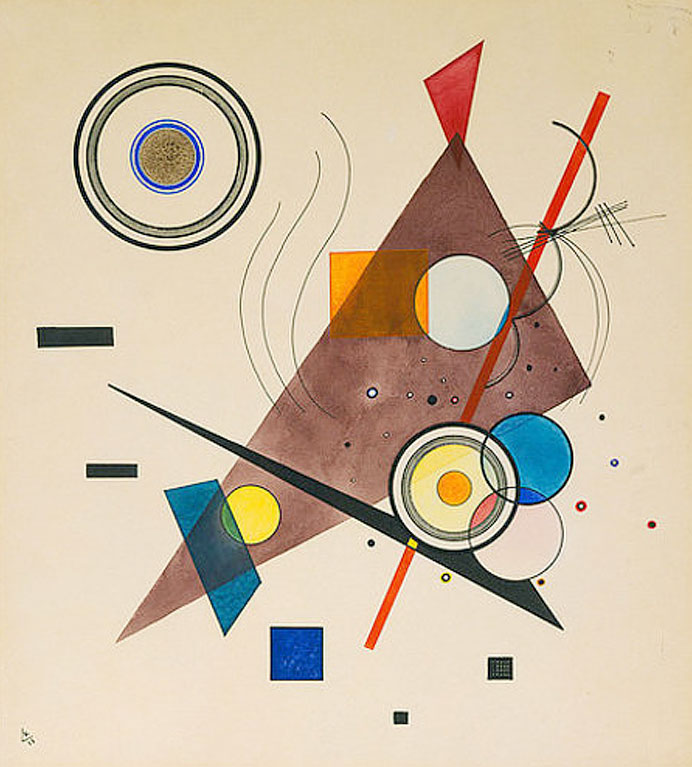

I love art and I love coding so I thought why not combine them. A long while ago I created a Kandinsky composition generator. And I thought I would share my process here.

For those who aren't familiar Kandinsky was a painter and art theorist who was a pioneer for abstract art.

Here are some examples of his works that he calls compositions:

You’ll find this post in your `_posts` directory. Go ahead and edit it and re-build the site to see your changes. You can rebuild the site in many different ways, but the most common way is to run `jekyll serve`, which launches a web server and auto-regenerates your site when a file is updated.

Jekyll requires blog post files to be named according to the following format:

`YEAR-MONTH-DAY-title.MARKUP`

Where `YEAR` is a four-digit number, `MONTH` and `DAY` are both two-digit numbers, and `MARKUP` is the file extension representing the format used in the file. After that, include the necessary front matter. Take a look at the source for this post to get an idea about how it works.

Jekyll also offers powerful support for code snippets:


def print_hi(name)
puts "Hi, #{name}"
end
print_hi('Tom')
#=> prints 'Hi, Tom' to STDOUT.


Check out the [Jekyll docs][jekyll-docs] for more info on how to get the most out of Jekyll. File all bugs/feature requests at [Jekyll’s GitHub repo][jekyll-gh]. If you have questions, you can ask them on [Jekyll Talk][jekyll-talk].

[jekyll-docs]: https://jekyllrb.com/docs/home
[jekyll-gh]: https://github.com/jekyll/jekyll
[jekyll-talk]: https://talk.jekyllrb.com/
